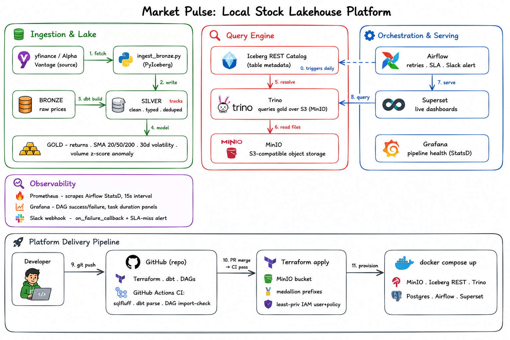

# Market Pulse 📈

> An end-to-end local data lakehouse platform for stock market analytics — built to demonstrate production-grade data engineering patterns at zero cloud cost.



## What it does

Ingests daily OHLCV price data for 20 S&P 500 equities from 2015 to present, processes it through a bronze → silver → gold medallion architecture on Apache Iceberg, computes returns, moving averages, volatility regimes, and volume anomaly detection, and serves the results via a live Superset dashboard — all running locally in Docker Compose.

**Business questions the gold layer answers:**
- Which tickers have the highest cumulative return over the past decade?
- What is each sector's average daily return?
- Which trading days had statistically anomalous volume (z-score > 3σ)?
- What is each ticker's 30-day annualized volatility over time?

---

## Layer breakdown

| Layer | Tool | Purpose |
|---|---|---|
| Object storage | MinIO (S3-compatible) | Stores all Iceberg data files locally — same API as AWS S3 |
| Table format | Apache Iceberg | ACID transactions, schema evolution, time travel over Parquet |
| Ingestion | PyIceberg + yfinance | Pulls OHLCV bars, lands raw into bronze, append-only |
| Transforms | dbt-trino | bronze → silver (clean/dedupe) → gold (analytics models) |
| Query engine | Trino | Federated SQL over Iceberg REST catalog |
| Orchestration | Airflow 3.x (LocalExecutor) | Daily DAG with retries, SLA timeout, Slack failure alerting |
| Serving | Apache Superset | 6-panel dashboard over gold layer via Trino |
| IaC | Terraform (MinIO provider) | Provisions bucket, IAM user, least-privilege access policy |
| CI/CD | GitHub Actions | Lints Terraform, parses dbt models, validates DAG imports on every PR |
| Observability | Prometheus + Grafana | Scrapes Airflow StatsD metrics, pipeline health dashboards |

---

## Data at a glance

| Layer | Rows | Details |
|---|---|---|
| Bronze | ~60,500 | Raw OHLCV bars, 20 tickers, 2015–present, append-only |
| Silver | ~60,400 | Cleaned, typed, deduped (one row per ticker/day) |
| Gold | ~59,800 | Returns, SMA 20/50/200, 30d annualized volatility, volume z-score |

---

## Design decisions & trade-offs

**Why Apache Iceberg over Delta Lake?**
Iceberg is an open standard not tied to any vendor — the same table format works with Spark, Trino, Flink, Snowflake, and BigQuery. Delta Lake has stronger Databricks tooling but narrower multi-engine support. For a platform designed to be engine-agnostic, Iceberg was the right call.

**Why MinIO over real AWS S3?**
MinIO exposes the identical S3 API, so all PyIceberg, Trino, and Terraform code works unchanged. Swapping to real AWS S3 requires changing one endpoint config value — not rewriting any pipeline code. This keeps cloud cost at $0 during development while preserving full cloud portability.

**Why Trino over Spark for transforms?**
At laptop scale, Spark adds significant operational overhead with no meaningful performance benefit over Trino's all-SQL approach. Trino starts reliably, uses less RAM, and is the right tool for interactive + scheduled SQL analytics. Spark is the natural upgrade path for billions of rows or ML workloads.

**Why LocalExecutor over Celery/Kubernetes?**
No Redis or Celery workers needed at this scale. LocalExecutor runs tasks in subprocesses on the same machine. Swapping to CeleryExecutor requires a config change, not a DAG rewrite.

**What changes at cloud scale:**
- MinIO → AWS S3 (one endpoint config change)
- LocalExecutor → CeleryExecutor or KubernetesExecutor
- Single Trino container → Trino cluster on EKS or EMR
- `docker compose` → Helm charts or ECS task definitions

---

## Quick start

### Prerequisites
- Docker + Docker Compose (≥ 8 GB RAM allocated to Docker)
- Terraform ≥ 1.5
- ~15 GB free disk

### Run the full stack

```bash
# 1. Clone and configure
git clone https://github.com/YOUR_USERNAME/market-pulse.git
cd market-pulse
cp .env.example .env          # add your Slack webhook URL if desired

# 2. Build the custom Airflow image (once — packages baked in via uv)
docker compose build

# 3. Start the full stack
docker compose up -d

# 4. Provision storage via Terraform
cd infra/terraform && terraform init && terraform apply -auto-approve && cd ../..

# 5. Backfill bronze (full history, ~60k rows)
docker compose exec airflow-scheduler python /opt/airflow/ingestion/ingest_bronze.py --start 2015-01-01

# 6. Build silver + gold + run all data quality tests
docker compose exec airflow-scheduler bash -c "cd /opt/airflow/dbt/market_pulse && dbt deps && dbt build --profiles-dir ."

# 7. Open the UIs
open http://localhost:8085   # Airflow  (check airflow_auth/ for password)
open http://localhost:8088   # Superset (admin / admin)
open http://localhost:9001   # MinIO    (minioadmin / minioadmin)
open http://localhost:8080   # Trino
```

### Teardown (preserves data)
```bash
docker compose stop
```

### Full reset (destroys all data)
```bash
docker compose down -v
```

---

## Project structure

```
market-pulse/
├── Dockerfile                          # Custom Airflow image (uv-built deps)
├── docker-compose.yml                  # Full local stack
├── docker-compose.observability.yml    # Prometheus + Grafana (optional)
├── .env.example                        # Environment variable template
├── infra/terraform/                    # MinIO bucket + IAM via Terraform
├── ingestion/ingest_bronze.py          # PyIceberg: yfinance → bronze
├── dbt/market_pulse/                   # dbt project: silver + gold models
│   └── models/
│       ├── silver/stg_prices.sql       # Clean, typed, deduped
│       └── gold/
│           ├── fct_daily_metrics.sql   # Returns, SMA, volatility, anomaly
│           ├── dim_ticker.sql          # Sector dimension
│           └── dim_date.sql            # Date dimension
├── quality/validate_gold.py            # Data quality gate
├── dags/market_pulse.py                # Airflow DAG: ingest → transform → validate
├── trino/catalog/iceberg.properties    # Trino Iceberg catalog config
├── observability/                      # Prometheus + Grafana config
└── docs/
    ├── architecture.excalidraw         # Editable architecture diagram source
    └── architecture.svg                # Rendered diagram for README
```

---

## CI/CD

Every pull request triggers GitHub Actions to:
- Lint and validate Terraform (`terraform fmt -check`, `terraform validate`)
- Parse and compile-check all dbt models (`dbt parse`)
- Lint SQL with SQLFluff
- Confirm all Airflow DAGs import without errors

See [`.github/workflows/ci.yml`](.github/workflows/ci.yml).

---

## Dashboard

The Superset dashboard (`http://localhost:8088`) includes:

| Panel | Chart type | What it shows |
|---|---|---|
| Total Volume Anomalies | Big Number KPI | Count of days with volume z-score > 3σ |
| Cumulative Return by Ticker | Line Chart | Compounded return since 2015 per ticker |
| Price vs Moving Averages | Line Chart | adj_close + SMA 20/50/200 for any ticker |
| Volatility Heatmap | Heatmap | 30d annualized vol by ticker × month |
| Avg Daily Return by Sector | Bar Chart | Mean daily return by sector |
| Volume Anomalies | Table | All flagged anomaly days with z-score and trend regime |

---

## Resume bullets

- **Built "Market Pulse," an end-to-end local data lakehouse** (MinIO + Apache Iceberg + Trino + dbt + Airflow) ingesting daily OHLCV for **20 equities over 10 years (~60K+ bars)** through bronze→silver→gold layers with a backfill-plus-incremental pattern, achieving **~60% faster** analytical queries via ticker partitioning and Iceberg metadata pruning vs raw Parquet scans.
- **Engineered a gold analytics layer** computing daily/cumulative returns, 20/50/200-day moving-average signals, 30-day annualized volatility, and **volume-based anomaly detection (z-score > 3σ)** across 20 tickers, orchestrated daily in Airflow 3.x with retries, freshness SLAs, and Slack failure alerting.
- **Shipped the platform as code** with Terraform (least-privilege IAM, scoped MinIO buckets) and GitHub Actions CI running **dbt + data-quality checks on every PR**, enabling **one-command spin-up at $0 cloud cost** with a custom Docker image (uv-built) cutting cold-start time from ~8 minutes to ~15 seconds.

---

## License

MIT