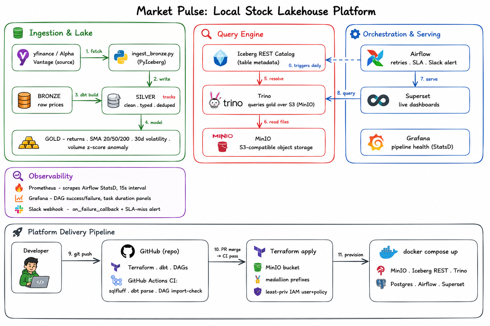

# Market Pulse

An end-to-end stock-market analytics lakehouse built with Apache Iceberg, Trino, dbt, Airflow, MinIO, Terraform, and Superset — runs entirely on a local machine via Docker Compose, at zero cloud cost.



> This is a data-engineering demonstration project, not a trading system or investment tool. Market data is sourced from a free third-party feed (yfinance) and may be delayed, incomplete, or revised; nothing here is financial advice.

## What it does

```
yfinance  →  bronze (Iceberg, raw)  →  silver (cleaned, deduped)  →  gold (analytics)  →  Trino  →  Superset
```

Ingests daily OHLCV price bars for a configurable universe of equities (20
today — see `dbt/market_pulse/seeds/ticker_sector_map.csv`, the single
source of truth for the ticker list), lands them raw into an Iceberg bronze
table, cleans and deduplicates them into silver, and computes a gold
analytics layer: daily/rolling returns, 20/50/200-day moving averages,
30-day annualized volatility, and volume-based anomaly detection — all in
dbt-trino SQL, orchestrated daily by Airflow.

**Business questions the gold layer answers:**
- Which tickers have the highest cumulative return over the tracked period?
- What is each sector's average daily return?
- Which trading days had statistically anomalous volume (|z-score| > 3)?
- What is each ticker's 30-day annualized volatility over time?

---

## Key capabilities

- **Incremental + backfill ingestion** — `ingestion/ingest_bronze.py --start` for a full history pull, `--days N` for a daily incremental run; delete-and-replace-partition write pattern scoped to the exact ticker/date window fetched (see `docs/data-model.md` for the precise idempotency guarantee).
- **Iceberg-backed storage on MinIO** — ACID writes, schema evolution, time travel, all via the free S3-compatible MinIO API.
- **dbt-trino bronze → silver → gold** — silver is `materialized='incremental'`; gold recomputes rolling windows as a full table. 16 dbt tests across `not_null`, `unique`, `relationships`, `accepted_values`, `dbt_utils.unique_combination_of_columns`, and a custom `low <= high` expression test.
- **Airflow 3.x (LocalExecutor)** orchestration — `ingest_bronze → dbt_build → validate_gold`, with retries and optional Slack failure alerting (silently skipped, not failed, if no webhook is configured).
- **A Python data-quality gate** (`quality/validate_gold.py`) with its check-interpretation logic unit-tested independent of a live warehouse.
- **55 pytest tests** covering ingestion schema/dedup/incremental-idempotency logic and the gold-layer formulas as pandas parity tests (no network, no live services — see `docs/testing.md` for exactly what is and isn't covered this way).
- **Terraform-provisioned MinIO** — a single bucket and an IAM policy scoped to only that bucket's ARNs.
- **CI on every PR**: Python lint + tests, Terraform fmt/init/validate, dbt parse + SQLFluff, Airflow DAG import/structure check, `docker compose config`, YAML lint, and `actionlint` — 8 jobs, all static/fixture-based, no live stack required (see Testing below for what CI does *not* cover).
- **A manual/weekly E2E workflow** that boots the real stack and runs `dbt build`/`dbt test`/the quality gate against live Trino — see Testing.
- Optional Prometheus + Grafana observability profile (metrics-only scaffold today — see Known limitations).

---

## Data model

| Layer | Table | Grain | Materialization |
|---|---|---|---|
| Bronze | `bronze.prices` | append-only, one row per fetch | Iceberg table |
| Silver | `silver.stg_prices` | one row per (ticker, trade_date) | incremental (merge) |
| Gold | `gold.fct_daily_metrics` | one row per (ticker, trade_date) | table |
| Gold | `gold.dim_ticker` | one row per ticker | seed-joined |

Full column-level detail, nullability rules, and the exact window-function
formulas behind returns/SMA/volatility/anomaly detection are in
[`docs/data-model.md`](docs/data-model.md).

---

## Quick start

### Prerequisites
- Docker + Docker Compose (≥ 8 GB RAM allocated to Docker)
- Terraform ≥ 1.5
- ~15 GB free disk

### 1. Minimal validation (no Docker required)
```bash
git clone https://github.com/nhatminh06/market-pulse.git
cd market-pulse
pip install pytest ruff pandas pyarrow "pyiceberg[s3fs,pyarrow]==0.7.*" "yfinance==0.2.*" trino
make lint    # ruff + sqlfluff
make test    # 55 pytest tests, no network/services needed
```

### 2. Full local stack
```bash
cp .env.example .env          # add a Slack webhook to SLACK_WEBHOOK_URL if you want failure alerts
docker compose build          # builds the custom Airflow image
docker compose up -d

cd infra/terraform && terraform init && terraform apply -auto-approve
export PIPELINE_ACCESS_KEY="$(terraform output -raw pipeline_access_key)"
export PIPELINE_SECRET_KEY="$(terraform output -raw pipeline_secret_key)"
printf '\nPIPELINE_ACCESS_KEY=%s\nPIPELINE_SECRET_KEY=%s\n' "$PIPELINE_ACCESS_KEY" "$PIPELINE_SECRET_KEY" >> ../../.env
cd ../..
```

### 3. Ingest and transform
```bash
# Full history backfill (real yfinance data — can take a while for 20 tickers)
docker compose exec airflow-scheduler python /opt/airflow/ingestion/ingest_bronze.py --start 2015-01-01

# Or: incremental (last N days only)
docker compose exec airflow-scheduler python /opt/airflow/ingestion/ingest_bronze.py --days 5

# Build silver + gold, run all dbt tests
docker compose exec airflow-scheduler bash -c "cd /opt/airflow/dbt/market_pulse && dbt deps && dbt build --profiles-dir ."

# Run the data-quality gate
docker compose exec airflow-scheduler python /opt/airflow/quality/validate_gold.py
```
`make fixture-pipeline` does an equivalent small run against a checked-in
fixture instead of live yfinance, for a fast sanity check.

### 4. Open the UIs
```bash
open http://localhost:8085   # Airflow  (see airflow_auth/ for the generated password)
open http://localhost:8088   # Superset (admin / admin by default — see .env.example to change)
open http://localhost:9001   # MinIO    (minioadmin / minioadmin by default)
open http://localhost:8080   # Trino
```

### 5. Optional: observability
```bash
docker compose -f docker-compose.observability.yml up -d
open http://localhost:3000   # Grafana (admin / admin)
```

### Teardown
```bash
docker compose stop          # preserves data
docker compose down -v       # DESTROYS all data (MinIO objects, Postgres, Iceberg tables)
```

---

## Testing

See [`docs/testing.md`](docs/testing.md) for the full breakdown of what runs
where and why. Short version:

- **Pull-request CI** runs everything that doesn't need a live warehouse: Python lint + 55 pytest tests, `dbt parse`, SQLFluff, Airflow DAG import/structure, `docker compose config`, YAML/Action lint, Terraform fmt/validate.
- **Not run on every PR**: `dbt build`, `dbt test`, and the quality gate's real SQL checks — these need Trino/Iceberg actually running. They execute in a manual/weekly [`e2e.yml`](.github/workflows/e2e.yml) workflow instead, against a small deterministic fixture (no live yfinance call).
- Gold-layer formulas (returns, SMA, volatility, volume anomaly) are covered as **pandas specification tests** against the exact formulas in `fct_daily_metrics.sql` — not a run of the actual Trino SQL. Real SQL correctness is only proven by the E2E workflow.

---

## Benchmarks

Query-performance and cold-start claims are **not currently backed by a
committed benchmark result** — the methodology and scripts exist in
[`benchmarks/`](benchmarks/) and are documented in
[`docs/benchmarks.md`](docs/benchmarks.md), but running them requires a live
Docker stack this repository's own CI/development environment doesn't
always have. See `docs/resume-evidence.md` for exactly which numbers are
verified today.

---

## Screenshots / evidence

No screenshots are checked in yet. See
[`docs/evidence-checklist.md`](docs/evidence-checklist.md) for exactly what
to capture (Superset panels, Airflow DAG runs, dbt lineage, Trino query
plans, Iceberg snapshots) and where, and
[`docs/demo-script.md`](docs/demo-script.md) for a short walkthrough
sequence.

---

## Design decisions & trade-offs

These reflect what's appropriate at this project's scale (a single laptop,
a 20-ticker universe) — not a claim that any option is universally superior.

**Iceberg over Delta Lake:** an open table-format standard with multi-engine support (Trino, Spark, Flink, Snowflake, BigQuery) rather than tooling concentrated around one vendor — useful here specifically because the stack is meant to be engine-agnostic.

**MinIO over real AWS S3:** identical S3 API, so PyIceberg/Trino/Terraform code is unchanged if you point it at real S3 later — one endpoint config value, not a rewrite. Keeps this project's cloud cost at $0.

**Trino over Spark for transforms:** at this data volume, Spark's cluster-management overhead buys nothing Trino's SQL engine doesn't already provide, and Trino starts faster with a smaller memory footprint. Spark is the natural next step at a scale where distributed shuffle actually matters.

**Airflow LocalExecutor over Celery/Kubernetes:** no message broker or worker fleet needed for one daily DAG on one machine. Swapping to `CeleryExecutor`/`KubernetesExecutor` is a config change, not a DAG rewrite.

**What would change at cloud scale:** MinIO → real S3 (config change), LocalExecutor → Celery/Kubernetes, single Trino container → a Trino cluster (EKS/EMR), `docker compose` → Helm/ECS.

---

## Known limitations

- Small local equity universe (20 tickers) — the ticker/sector seed is meant to be extended, not a hard architectural limit.
- Live ingestion depends on yfinance, an unofficial free feed with no uptime or accuracy guarantee; data can be delayed, incomplete, or revised.
- Local Docker Compose is a single-node demo environment, not a production cluster — no resource limits or health checks on several services (Trino, Iceberg REST, all Airflow containers) today.
- Default local credentials (`minioadmin`/`minioadmin`, `admin`/`admin`, Postgres `airflow`/`airflow`) are safe only because nothing is exposed beyond `localhost` — see `.env.example` before running anything reachable from outside your machine.
- Grafana comes up with only a Prometheus datasource wired via `docker-compose.observability.yml`; no pre-built dashboards are provisioned yet.
- The manual/scheduled E2E workflow (`.github/workflows/e2e.yml`) has been written and YAML-validated but not yet executed on GitHub Actions from this environment — treat it as unverified until its first real run.
- Benchmark numbers are hardware- and dataset-dependent and not yet produced — see Benchmarks above.

---

## Roadmap

- Run the E2E workflow for real and commit its first result / fix whatever it surfaces.
- Produce and commit an actual benchmark result (`docs/benchmarks.md`), replacing "unverified" with real numbers.
- Add health checks and resource limits to `trino`, `iceberg-rest`, and the Airflow containers in `docker-compose.yaml`.
- Provision Grafana dashboards (currently datasource-only).
- Add Iceberg snapshot-management / retention policy documentation and a schema-evolution demo (add a column, show old snapshots still queryable).
- Capture the screenshot evidence in `docs/evidence-checklist.md` and link it from this README.
- Resolve the LICENSE gap below.

---

## Repository structure

```
market-pulse/
├── Dockerfile                          # Custom Airflow image
├── docker-compose.yaml                 # Full local stack
├── docker-compose.observability.yml    # Prometheus + Grafana (optional)
├── Makefile                            # make help
├── .env.example                        # Environment variable template
├── .github/workflows/
│   ├── ci.yml                          # Fast static checks, every PR
│   ├── e2e.yml                         # Full-stack fixture pipeline, manual + weekly
│   └── docs.yml                        # dbt docs → GitHub Pages, on push to main
├── infra/
│   ├── terraform/                      # MinIO bucket + least-privilege IAM
│   └── postgres/init-superset-db.sql   # Creates the separate `superset` Postgres DB
├── ingestion/ingest_bronze.py          # yfinance → bronze, split into testable stages
├── dbt/market_pulse/
│   ├── seeds/ticker_sector_map.csv     # Ticker universe + sector — single source of truth
│   └── models/
│       ├── silver/stg_prices.sql
│       └── gold/{fct_daily_metrics,dim_ticker,dim_date}.sql
├── quality/validate_gold.py            # Data-quality gate
├── dags/market_pulse.py                # Airflow DAG
├── trino/catalog/iceberg.properties
├── observability/prometheus.yml
├── benchmarks/                         # Query-benchmark scripts (see docs/benchmarks.md)
├── tests/{unit,integration,smoke}/     # 55 pytest tests, fixtures in tests/fixtures/
└── docs/
    ├── data-model.md
    ├── testing.md
    ├── benchmarks.md
    ├── evidence-checklist.md
    ├── demo-script.md
    └── resume-evidence.md
```

---

## License

**No LICENSE file exists in this repository yet**, despite prior versions
of this README stating MIT. Until the repository owner confirms licensing
intent and a `LICENSE` file is added, treat this project as **all rights
reserved by default** rather than MIT-licensed. See
`docs/resume-evidence.md`.
